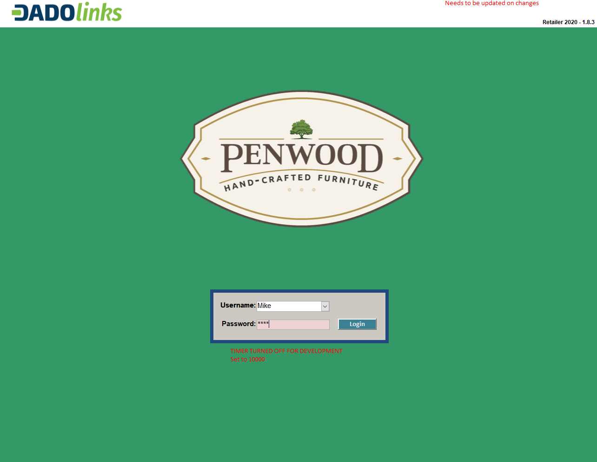
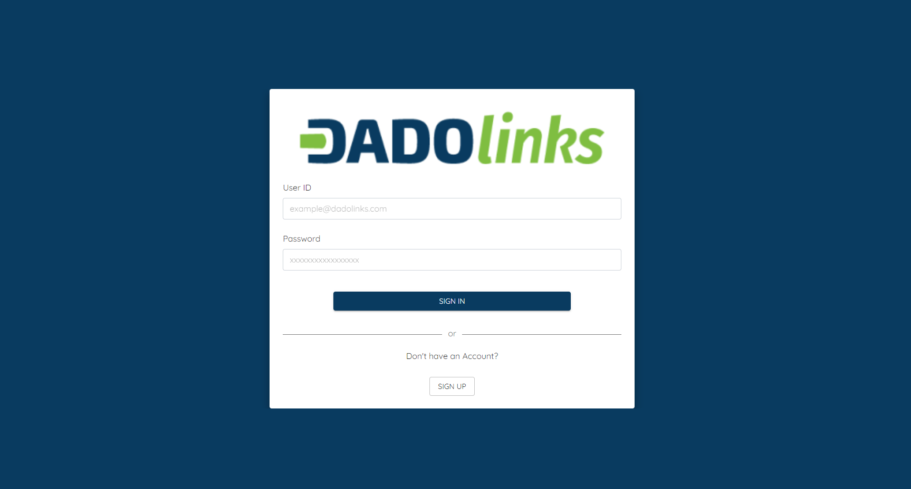
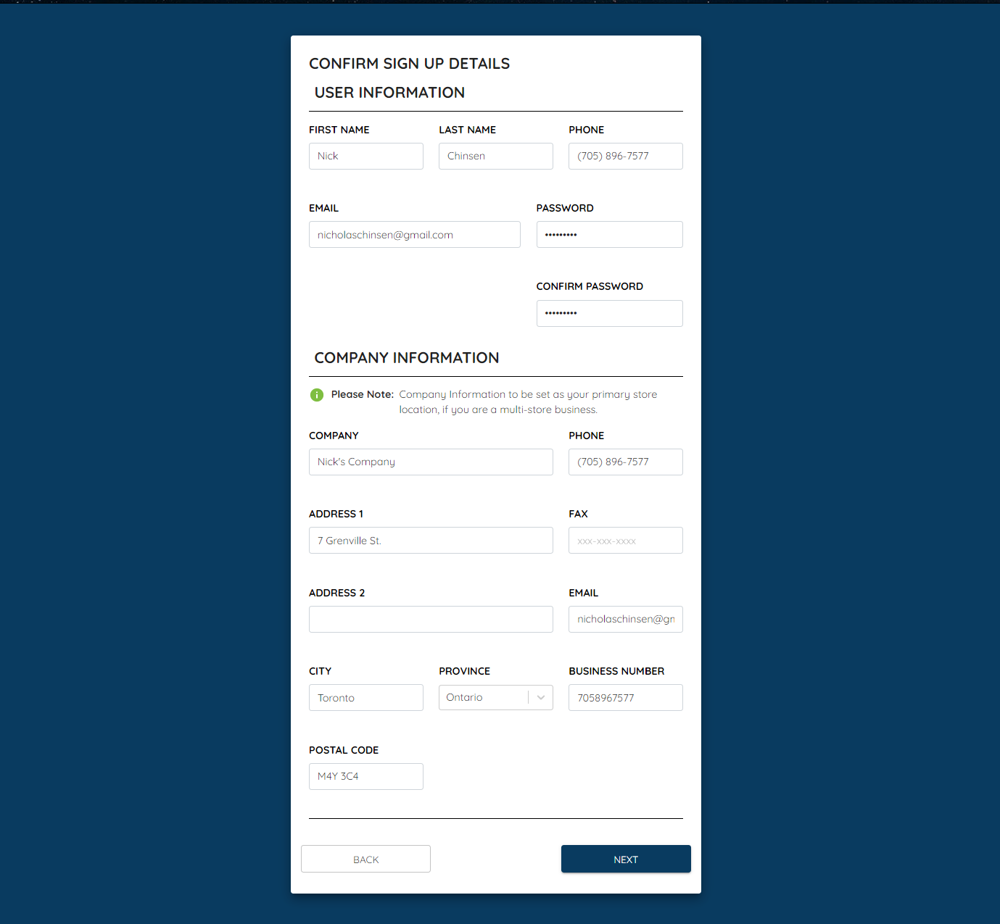
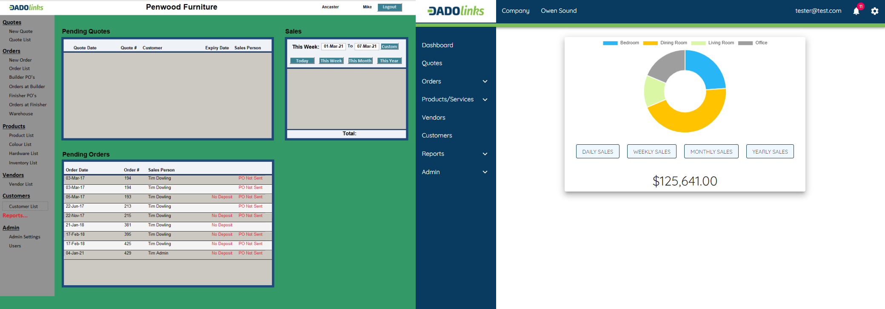
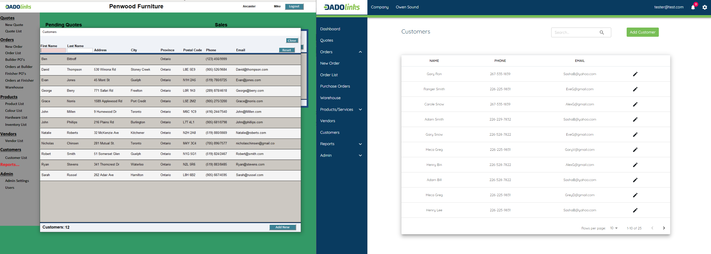
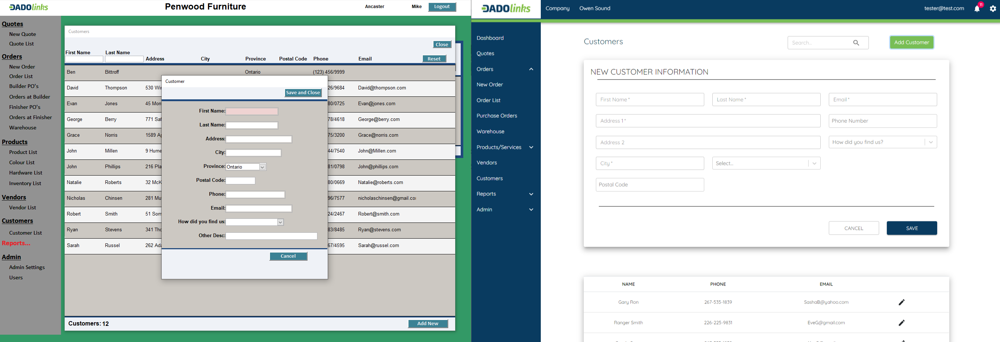
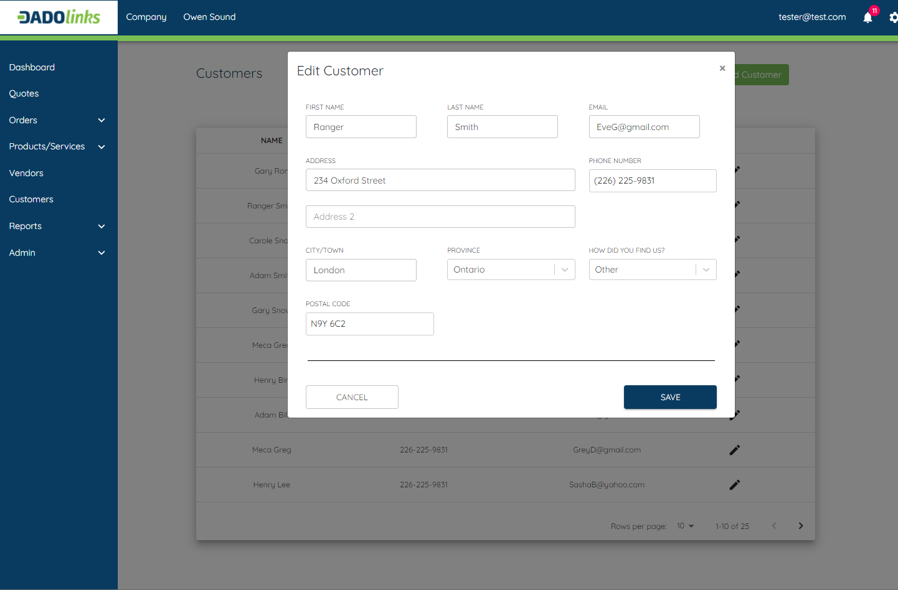

# [Retailer Application Rework](https://github.com/karnnivore)
The basis of this project is to solve the need for a more streamlined application for the Build To Order furniture industry. This application connects finishers, builders, and stores in one central application cutting down the average time from ordering a custom furniture piece from  6-14 weeks to 2-3 weeks or an 85% reduction in wait times from worst - best time. 

# My Task
I was hired on as a full stack developer CO-OP student until the end of April and I'm tasked with converting their old legacy Microsoft Access application into a modern Web Application using React, SQL, Redux, Material UI, Docker, and Microsoft Azure Cloud Services. 

## The Problem
Currently in the custom build to order furniture industry the time from ordering a custom piece to receieving that custom furniture takes on average 6-14 weeks. The main bottleneck in this process is the delayed communications between the three main parts of the supply chain (Finishers, Builders & Retailers). Things are also slowed down by the lack of automation and human error, as orders can be lost or a sales person can get busy and forget about sending an order to the next part of the supply chain. 

## Our Solution
The solution Dadolinks/Axcys came up with is a centralized retailer application that will connect Finishers, Builders, and Retail Stores in one convienent & fast application. Originally there was a legacy program created by the CEO which was made using Microsoft Access. 

### Legacy Application

### Updated Login

## First Task
My first tasks were to update the login page, and create a registration page for new users of the application. I created a login page in addition to registration pages which were connected with Redux Store and eventually writes to our backend SQL database using a REST API to communicate with our server. I also implemented authentication and resulting in only authorized users being able to view/use the system

### New Registration Confirmation Screen

## Next the Dashboard
The dashboard needed a lot of work and I created the updated version with a more modern feel. I mainly used elements from Material UI in addition to Chart.JS to create a new modern dashboard for the application

## Updating lists and adding new items to lists
Currently I'm working on updating the various lists which showcase things such as products, vendors, hardware, colour options, and more. 

### Comparison of old/new Customer Component

### Comparison of old/new Add Customer Component

### New Editing Modal
We decided to use modals which pop up when a user clicks to edit a certain customer, product, colour, etc.

 
# Next Steps
I'm currently working on the application full time and will be periodically updating this page as the project moves forward towards a production ready application by April when my CO-OP finishes.